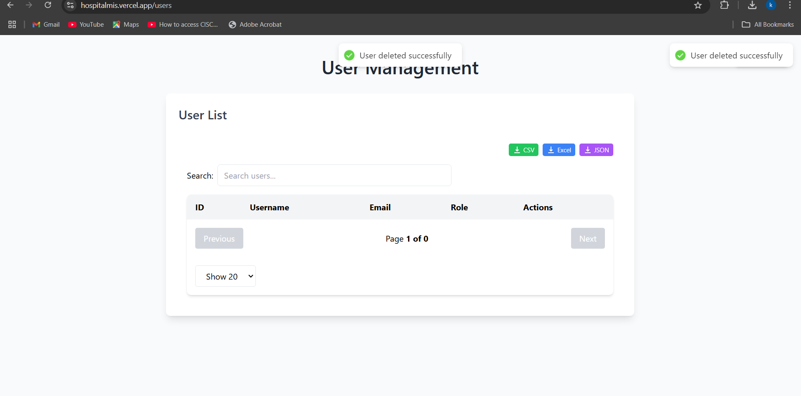

# Hospital Management System Documentation

## 1. Project Overview
- Project Name: Hospital Management System
- Purpose: Streamline hospital operations and patient management
- Key Objectives:
    - Efficient user management
    - Secure authentication
    - Comprehensive system functionality

## 2. Technology Stack
- Frontend:
    - React.js
    - React Router
    - Tailwind CSS
    - Axios/Custom API service
- Backend:
    - Spring Boot
    - Spring Security
    - JPA/Hibernate
    - PostgresSQL Database
- Authentication: JWT-based token authentication

## 3. System Architecture
### 3.1 Frontend Architecture
- Component-based structure
- Modular route protection
- State management
- Service-based API interactions

### 3.2 Backend Architecture
- RESTful API design
- Layered architecture (Controller, Service, Repository)
- Role-based access control

## 4. Key Features
- User Registration
- User Authentication
- Role-based Access Control
- User Management
- Secure Route Protection

## 5. Authentication Workflow
1. User Registration
2. User Login
3. JWT Token Generation
4. Route Protection
5. Token Validation

## 6. Security Measures
- Password Encryption
- JWT Token Authentication
- Protected Routes
- Role-based Access Control

## 7. API Endpoints
### User Management
- `/api/auth/login` - User Login
- `/api/users/register` - User Registration
- `/api/users/all` - Get All Users
- `/api/users/update/{id}` - Update User
- `/api/users/delete/{id}` - Delete User

## 8. Frontend Components
- Landing Page
- Login Page
- Registration Page
- User Management Dashboard
- Protected Routes Component

## 9. Backend Services
- UserService
- AuthenticationService
- Security Configuration

## 10. Database Schema
- User Table
    - id (Primary Key)
    - username
    - email
    - password (encrypted)
    - role
    - profile details
  
- Reset Token
    - id
    - token
    - user
    - expiryDate

## 11. Error Handling
- Global Error Handling
- Authentication Errors
- API Error Responses
- Frontend Error Notifications

## 12. Future Enhancements
- Advanced Role Management
- Audit Logging
- More Comprehensive User Profiles
- Enhanced Security Features

## 13. Installation and Setup
### Prerequisites
- Node.js
- Java 17+
- PostgresSQL
- Maven 

### Frontend Setup
```bash
git clone https://github.com/Kalinda11/WebTechFinal-FrontEnd-25265.git
cd frontend
npm install
npm run dev
```

### Backend Setup
```bash
git clone  https://github.com/Kalinda11/WebTechFinal-25265.git 
cd backend
mvn clean install
mvn spring-boot:run
```

## 14. Deployment
- Frontend: Vercel
- Backend: Vercel
- Database: Cloud PostgresSQL/RDS

## 15. Contribution Guidelines
- Fork Repository
- Create Feature Branch
- Submit Pull Request
- Follow Coding Standards
## 16. Links
- Frontend Repo https://github.com/Kalinda11/WebTechFinal-FrontEnd-25265  
## 16. Images
 
 
 
 
 
 
 
 
 
 
 
   
   

 